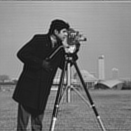
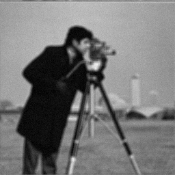
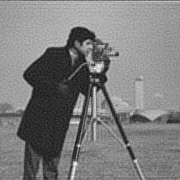

# Deconvolution with Landweber Algorithm

1. Compile c code: ```./compilegcc DeconvolutionWithLandweber``` 
2. Run executable file: ```./DeconvolutionWithLandweber```
3. Input the size of low-pass filter: "5" (depend on you) <br>
   Input the number of landweber iteration: "50" (for example:10,20,30...) <br>
4. Output 3 kinds of images: original image, blured image, restored image
5. Results
<br>



6. Input the variance of gaussian noise: "20" (it is up to you)
7. Output 2 kinds of images: blured+noised image, restored image
8. Results
<br>


